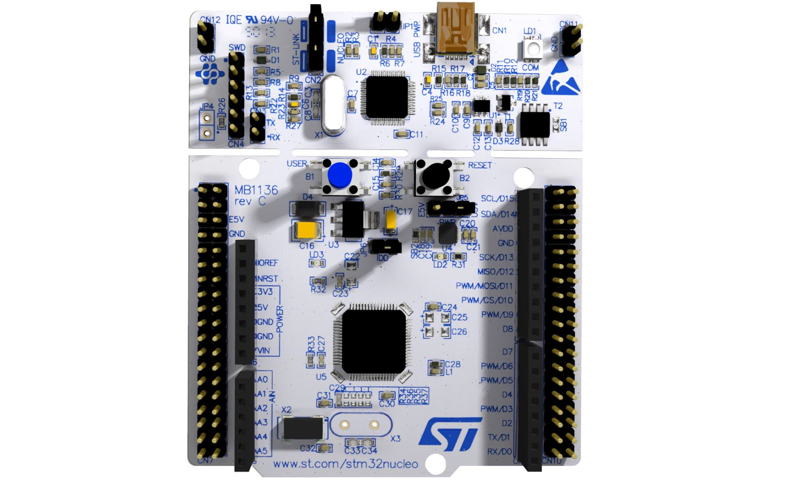

# Morse Code Translator

## Purpose
This was created as part of a UBC Orbit Command and Data Handling subsystem assignment. A phrase composed of capital letters and/or Arabic numerals is acquired from a UART module of user-specified size (up to 9 characters). Then, the Morse Code equivalent of the phrase is output onto the STM-32 Dev Board Green LED (GPIOA Pin 5). 

-----------------------------------------------------------------------------------------------------------------

The <a href= "src/startup/main.cpp">file</a> in which this is implemented is a C++ file written primarily in C. The repo is cloned from UBC Orbit to work with the STM-32 Microcontroller in preparation for future work on Trillium subsystem. 

-----------------------------------------------------------------------------------------------------------------

## Credit
Credit should be provided to <b>UBC Orbit</b> and <b>Sam Schweigel</b> of <b>Command and Data Handling</b> for assistance in implementing the UART and debugging the code, involving pointers and STM library functions.

<i>Images are sourced from STM-32 Datasheets.</i>
